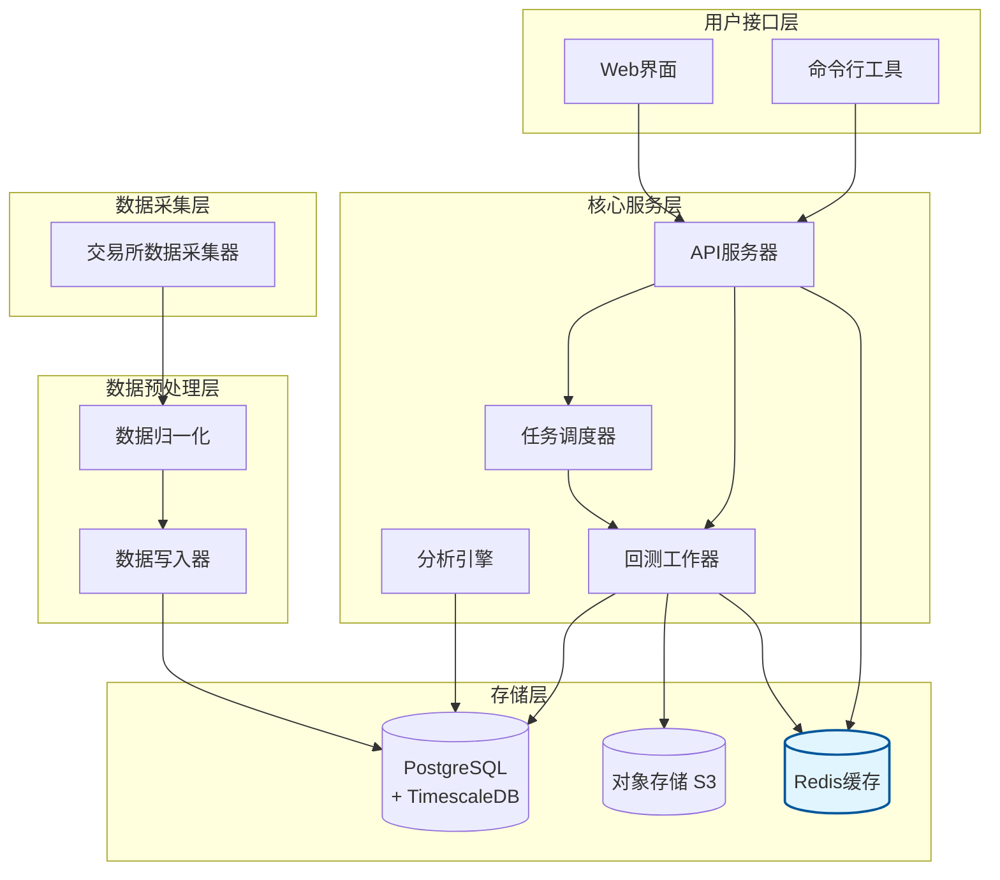

# UniQuant

**UniQuant** 是一个基于 **Rust + PostgreSQL** 构建的量化研究与交易平台，支持多种可交易标的物（股票、加密货币等），提供从数据存储到策略回测、模拟盘和实盘交易的一体化解决方案。

---

## ✨ 特性

- **多资产支持**：统一管理股票、加密货币及其他可交易资产  
- **高性能存储**：基于 PostgreSQL/TimescaleDB 管理行情、财报和情绪数据  
- **模块化分析**：可扩展的财务分析、健康诊断、安全性分析模块  
- **策略与信号**：支持多种量化策略、交易信号和指标计算  
- **回测系统**：历史行情回放与策略验证  
- **用户系统**：
  - 普通用户：使用自选股/币、策略配置、回测查询  
  - 超级用户：系统维护、权限管理、扩展功能  
- **未来功能**：
  - 财报解析与自然语言情绪分析
  - 模拟交易 / Paper Trading  
  - 实盘交易接入  
---

## 📂 模块结构（规划）
```
uniquant/
├── api/            # Rust Axum 接口相关
├── core/           # 核心库：配置/日志/数据库初始化等
├── collectors/     # 数据采集器
│ ├── queue/        # 队列抽象和实现（如Redis、内存队列）
│ ├── consumer/     # 消费者实现
│ ├── exchange/     # 交易所采集器（如币安、火币等）
│ ├── fundamental/  # 财报数据采集
│ ├── sentiment/    # 情绪数据采集
│ └── mod.rs        # 导出模块
├── backtest/       # 回测引擎
├── execution/      # 模拟盘 & 实盘交易
├── web/            # Web 前端（可选）
└── docs/           # 文档
```


## 🗄️ 数据库设计（示例）
- `instrument`：可交易标的物（股票、货币、期货...）  
- `exchange`：交易所信息  
  ```sql
  CREATE TABLE exchange (
    exchange_id BIGSERIAL PRIMARY KEY,
    code VARCHAR(50) NOT NULL UNIQUE,
    name TEXT
  );
  CREATE TABLE instrument (
    instrument_id BIGSERIAL PRIMARY KEY,
    exchange_id BIGINT NOT NULL REFERENCES exchange(exchange_id),
    symbol TEXT NOT NULL,
    name TEXT,
    asset_type VARCHAR(32) NOT NULL, -- stock|crypto|future|forex
    base_currency VARCHAR(10),
    quote_currency VARCHAR(10),
    metadata JSONB DEFAULT '{}',
    created_at TIMESTAMPTZ DEFAULT now(),
    UNIQUE (exchange_id, symbol)
  );
  CREATE INDEX idx_instrument_symbol ON instrument(symbol);
  ```
- `kline_xx`：多周期 K 线（1m, 1h, 1d ...）  
  ```sql
  CREATE TABLE kline_1m (
    instrument_id BIGINT NOT NULL REFERENCES instrument(instrument_id),
    tenant_id BIGINT, -- optional: NULL means global public data
    ts TIMESTAMPTZ NOT NULL,
    open DOUBLE PRECISION,
    high DOUBLE PRECISION,
    low DOUBLE PRECISION,
    close DOUBLE PRECISION,
    volume DOUBLE PRECISION,
    PRIMARY KEY (instrument_id, ts)
  );
  -- 转为 hypertable（TimescaleDB）
  SELECT create_hypertable('kline_1m', 'ts', chunk_time_interval => INTERVAL '1 day');

  CREATE TABLE kline_1d (
    instrument_id BIGINT NOT NULL REFERENCES instrument(instrument_id),
    tenant_id BIGINT,
    ts DATE NOT NULL,
    open DOUBLE PRECISION,
    high DOUBLE PRECISION,
    low DOUBLE PRECISION,
    close DOUBLE PRECISION,
    volume DOUBLE PRECISION,
    PRIMARY KEY (instrument_id, ts)
  );
  SELECT create_hypertable('kline_1d', 'ts', chunk_time_interval => INTERVAL '30 days');
  ```
- `fundamental`：财报、基本面指标  
  ```sql
  CREATE TABLE feature_metric (
    instrument_id BIGINT NOT NULL REFERENCES instrument(instrument_id),
    metric_name TEXT NOT NULL,
    ts TIMESTAMPTZ NOT NULL,
    value DOUBLE PRECISION,
    detail JSONB,
    PRIMARY KEY (instrument_id, metric_name, ts)
  );
  SELECT create_hypertable('feature_metric', 'ts', chunk_time_interval => INTERVAL '7 days');
  ```
- `strategy_config`：用户自定义策略与参数  
- `backtest_result`：回测结果（JSON 指标存储）  
- `tenant`，`user`, `user_portfolio`：用户与自选资产  
  ```sql
    CREATE TABLE tenant (
    tenant_id BIGSERIAL PRIMARY KEY,
    name TEXT NOT NULL,
    plan VARCHAR(50) DEFAULT 'free',
    created_at TIMESTAMPTZ DEFAULT now()
  );

  CREATE TABLE app_user (
    user_id BIGSERIAL PRIMARY KEY,
    tenant_id BIGINT NOT NULL REFERENCES tenant(tenant_id),
    email TEXT NOT NULL UNIQUE,
    display_name TEXT,
    password_hash TEXT,
    role VARCHAR(20) NOT NULL DEFAULT 'user', -- user | super
    created_at TIMESTAMPTZ DEFAULT now()
  );
  CREATE INDEX idx_app_user_tenant ON app_user(tenant_id);
  ```


### 环境依赖
- Rust (≥ 1.80)
- PostgreSQL (推荐 TimescaleDB 插件)
- Docker（可选）

### 架构图

📈 路线图

- [ ] 基础数据采集（多交易所）
- [ ] K 线存储与查询
- [ ] 用户系统 & 自选股
- [ ] 策略定义与信号计算
- [ ] 回测系统
- [ ] 财报/情绪分析模块
- [ ] 模拟盘
- [ ] 实盘交易接入


## 🤝 贡献
欢迎提交 Issue 和 PR，一起完善 UniQuant 🚀